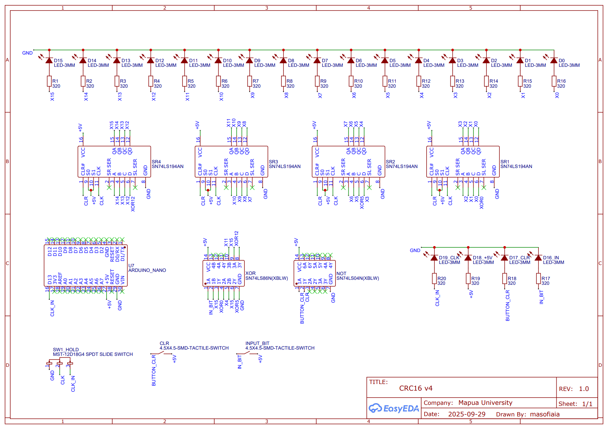
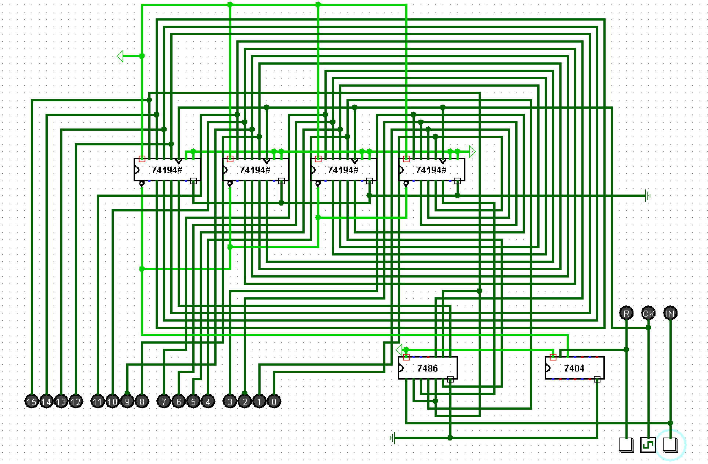
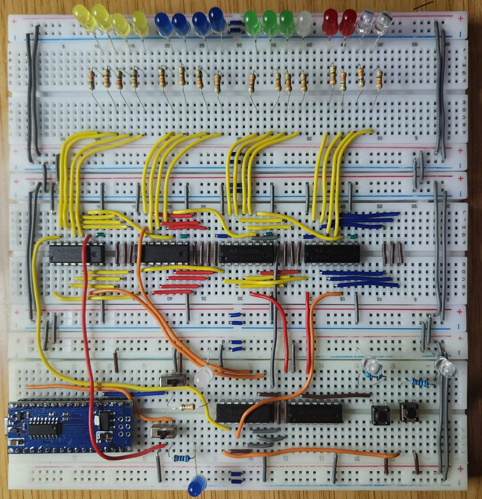
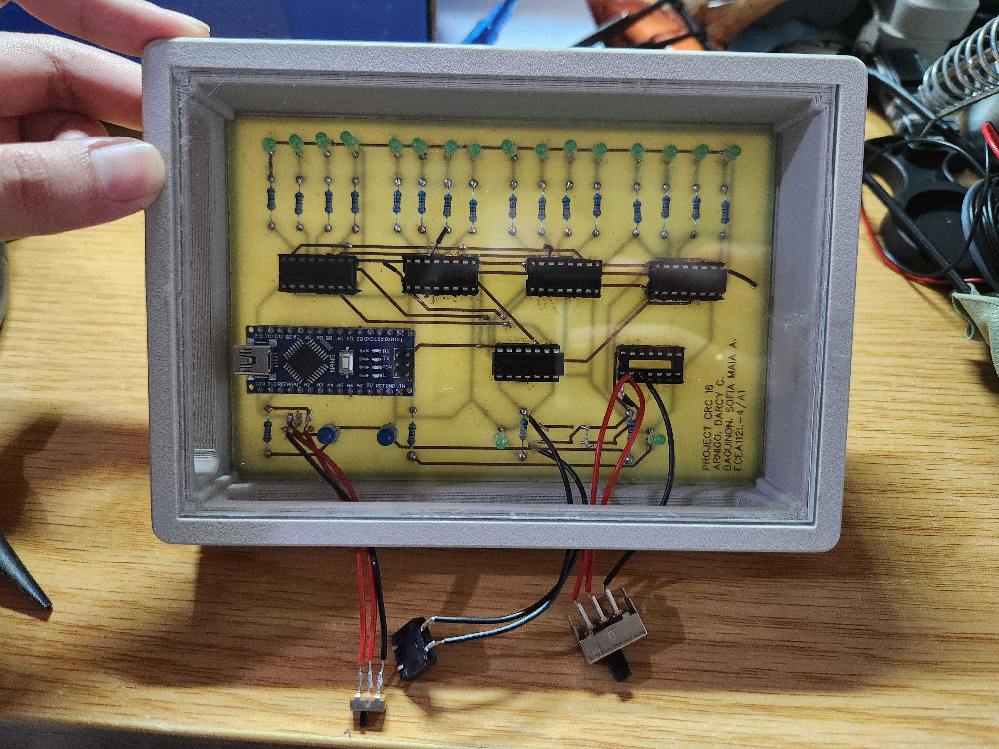
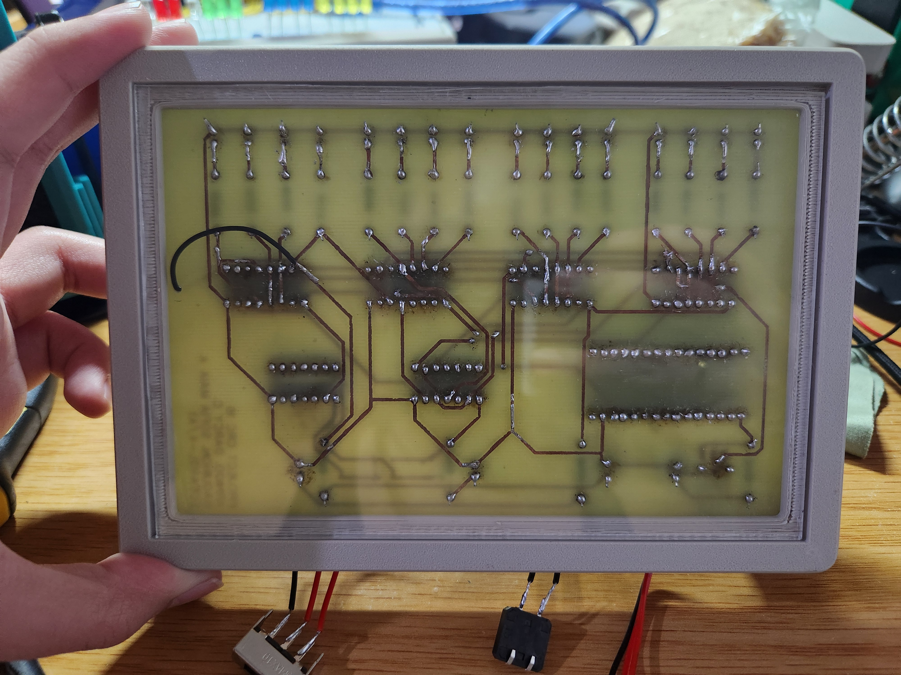
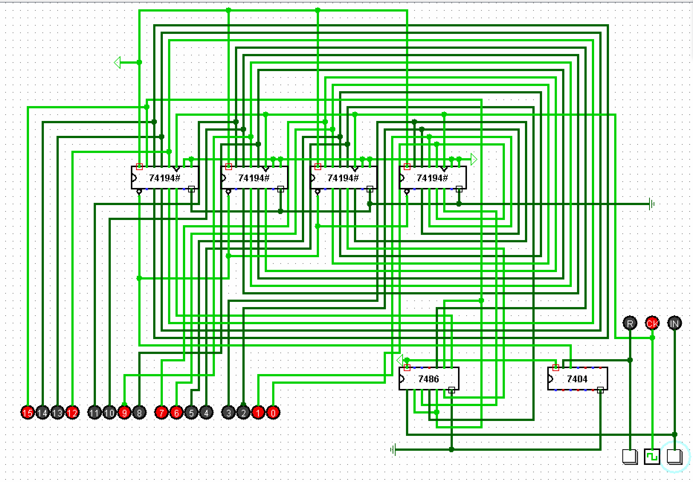
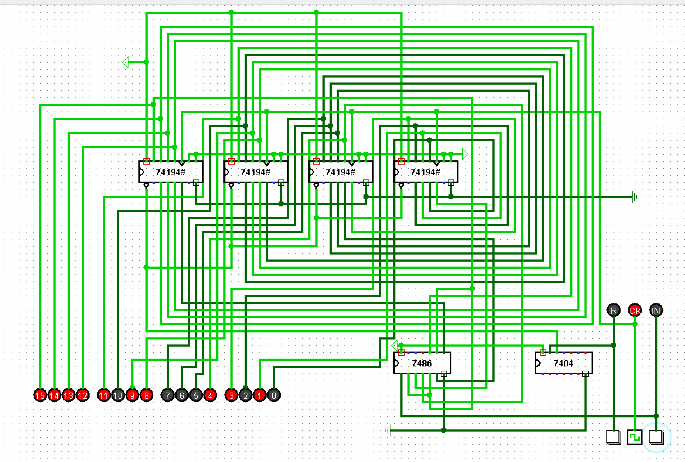
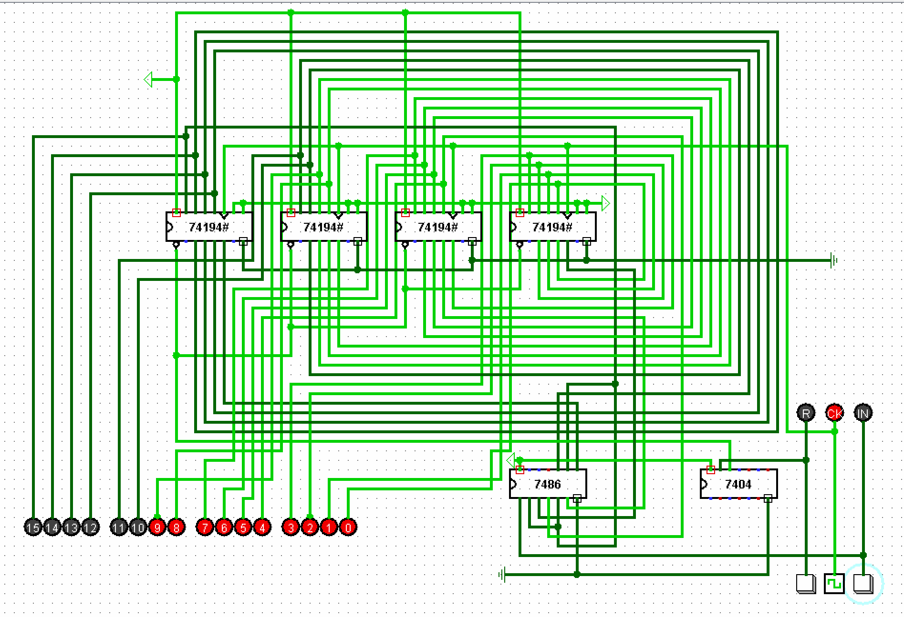

# CRC16 Circuit

A hardware implementation of a CRC-16 circuit developed through simulation, breadboard prototyping, and custom PCB fabrication.

## Project Overview

The project implements CRC-16 logic using shift registers and XOR-based feedback. The design was first verified in simulation, then implemented on a breadboard, and finally transferred to a custom PCB.

## Design

### EasyEDA Schematic

## Arduino Clock Source

The Arduino Nano supplies 5 V power to the circuit and generates a 1 Hz clock signal.

This clock controls when the CRC-16 circuit accepts and shifts input data. Because of this, the user has to time each input with the clock so the intended bit is read correctly by the circuit.

[View the Arduino clock source](arduino/Clock.ino)

### Logic Overview

The CRC-16 circuit is built around four SN74LS194 4-bit universal shift registers connected to form a 16-bit register. On each active clock edge, the stored data advances through the registers while selected stages are fed back through XOR logic.

An SN74LS86 XOR gate implements the CRC feedback path, while the SN74LS04 inverter is used as part of the reset logic for clearing the register state. The input bit is combined with the feedback path before being shifted into the register, allowing the circuit to update the 16-bit CRC value one bit at a time.

The LEDs connected to the register outputs provide a direct visual indication of the current 16-bit state. The Arduino Nano supplies 5 V power and generates the clock signal. Since the circuit is clock-driven, the user sets the desired input before the active clock edge so that it is correctly captured by the shift registers.

### Logisim Circuit

The Logisim source file is available here:

[Open the Logisim simulation file](simulation/CRC16_Simulation_Logism.circ)

## Breadboard Prototype

## PCB Implementation

  
  

## Output Validation

The project was validated using three test cases across simulation, breadboard, and PCB implementations.

### Output 1

**Simulation**

**Breadboard Demo**

[Watch Output 1 Breadboard Demo](https://drive.google.com/file/d/1XpwJHklWsaaVDk4FPOY2Yh0EDlqXDVBN/view?usp=sharing)

**PCB Demo**

[Watch Output 1 PCB Demo](https://drive.google.com/file/d/1uItI6v-fr6tdMfrJ4lkqFr2EelPsx-tr/view?usp=sharing)

---

### Output 2

**Simulation**

**Breadboard Demo**

[Watch Output 2 Breadboard Demo](https://drive.google.com/file/d/1a-xOjlHnDgzhz3IAeYZgtOndhfysEaHk/view?usp=sharing)

**PCB Demo**

[Watch Output 2 PCB Demo](https://drive.google.com/file/d/1yQxbm3NHIUGogcneIDDjygoqKnRGvg1w/view?usp=sharing)

---

### Output 3

**Simulation**

**Breadboard Demo**

[Watch Output 3 Breadboard Demo](https://drive.google.com/file/d/1Tnp4OmnF4pjftiJ8B19GDywh05TSKt0m/view?usp=sharing)

**PCB Demo**

[Watch Output 3 PCB Demo](https://drive.google.com/file/d/1Hzwd3I4S90Bb3oA-rxGjQUXEk-qXFDB8/view?usp=sharing)

## Tools and Components

- Logisim
- EasyEDA STD
- Arduino Nano
- SN74LS194 shift registers
- SN74LS86 XOR gate
- SN74LS04 inverter
- Breadboard prototyping
- Custom PCB fabrication
- 3D-printed enclosure

## Status

Completed and validated through simulation, breadboard testing, and PCB implementation.
